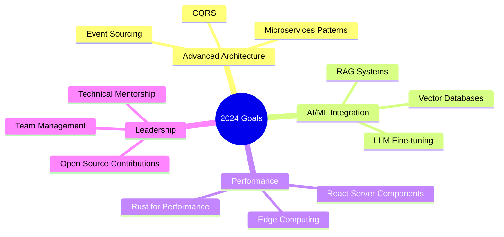

<div align="center">
  
# 💫 Hemanathan


<p align="center">
  <a href="https://www.linkedin.com/in/YOUR_LINKEDIN"></a>
  <a href="mailto:your.email@example.com"></a>
  <a href="https://yourportfolio.com"></a>
  <a href="https://twitter.com/YOUR_TWITTER"></a>
</p>


</div>

---

## 🎯 About Me

```typescript
const hemanathan = {
    location: "Tamil Nadu, India",
    currentRole: "Software Engineer @ Sasthra",
    focus: ["Full-Stack Development", "AI Integration", "System Architecture"],
    techStack: {
        frontend: ["React", "Next.js", "Vite", "Tailwind CSS v4"],
        backend: ["Node.js", "Express", "FastAPI", "Flask"],
        mobile: ["Flutter", "React Native"],
        databases: ["MongoDB", "PostgreSQL", "Redis"],
        ai_ml: ["Hugging Face", "TensorFlow", "Claude API"],
        devops: ["Docker", "AWS", "CI/CD", "Nginx"]
    },
    architecture: ["Microservices", "RESTful APIs", "WebSocket", "Event-Driven"],
    currentlyLearning: ["Advanced System Design", "LLM Integration", "Performance Optimization"],
    interests: ["Travel & Adventure", "Trekking", "Water Sports", "Tech Innovation"]
};
```

<div align="center">
  
### 🚀 **"Building scalable solutions that solve real-world problems"**

</div>

---

## 🛠️ Technology Arsenal

<details open>
<summary><b>💻 Languages</b></summary>
<br/>


</details>

<details open>
<summary><b>⚡ Frontend Development</b></summary>
<br/>


</details>

<details open>
<summary><b>🔧 Backend Development</b></summary>
<br/>


</details>

<details open>
<summary><b>🗄️ Databases & Caching</b></summary>
<br/>


</details>

<details open>
<summary><b>📱 Mobile Development</b></summary>
<br/>


</details>

<details open>
<summary><b>🤖 AI/ML & Integration</b></summary>
<br/>


</details>

<details open>
<summary><b>☁️ DevOps & Cloud</b></summary>
<br/>


</details>

---

## 📊 GitHub Analytics

<div align="center">
  


</div>

---

## 🏆 GitHub Achievements

<div align="center">
  
[](https://github.com/ryo-ma/github-profile-trophy)

</div>
---

## 📈 Contribution Activity

<div align="center">


</div>

---

## 🐍 Contribution Snake

<div align="center">

<picture>
  <source media="(prefers-color-scheme: dark)" srcset="https://raw.githubusercontent.com/YOUR_USERNAME/YOUR_USERNAME/output/github-snake-dark.svg">
  <source media="(prefers-color-scheme: light)" srcset="https://raw.githubusercontent.com/YOUR_USERNAME/YOUR_USERNAME/output/github-snake.svg">
  
</picture>

</div>

---

## 📝 Latest Blog Posts & Articles

<!-- BLOG-POST-LIST:START -->
<!-- BLOG-POST-LIST:END -->

> 💡 *Connect your dev.to, Medium, or Hashnode account to automatically display your latest articles here!*

---

## 🎯 Current Learning Goals



---

## 💡 Problem Solving & Coding Stats

<div align="center">

<!--START_SECTION:waka-->
<!--END_SECTION:waka-->

</div>

---

## 🤝 Open Source Contributions

<div align="center">


</div>

---

## 🎭 Fun Facts

<table>
<tr>
<td width="50%">

### 🧠 Developer Life

```javascript
while (alive) {
    eat();
    code();
    sleep();
    repeat();
}
```

- ☕ Coffee-driven developer
- 🌙 Night owl coder
- 🎵 Music while coding enthusiast
- 📚 Continuous learner
- 🐛 Bug hunter extraordinaire

</td>
<td width="50%">

### 🌍 Beyond Code

- 🏔️ Adventure enthusiast - Trekking & hiking
- 🌊 Water sports lover
- 🗺️ Travel explorer across India
- 🎮 Strategic gamer
- 📸 Tech photography hobbyist
- 🎯 Always up for new challenges

</td>
</tr>
</table>

---

## 📬 Let's Connect!

<div align="center">

### I'm always open to interesting conversations and collaboration opportunities!

<table>
<tr>
<td align="center" width="33%">

**💼 Professional**

[](https://www.linkedin.com/in/YOUR_LINKEDIN)

[](mailto:your.email@example.com)

</td>
<td align="center" width="33%">

**🌐 Social**

[](https://twitter.com/YOUR_TWITTER)

[](https://yourportfolio.com)

</td>
<td align="center" width="33%">

**💬 Chat**

[](https://discord.com/users/YOUR_DISCORD)

[](https://t.me/YOUR_TELEGRAM)

</td>
</tr>
</table>

### 📧 **Email:** your.email@example.com
### 📍 **Location:** Tamil Nadu, India
### 🌐 **Website:** [yourportfolio.com](https://yourportfolio.com)

<br/>


---

<div align="center">

### 💙 Thanks for visiting! Don't forget to ⭐ star some repositories if you find them interesting!


**Last Updated:** 

</div>

</div>
